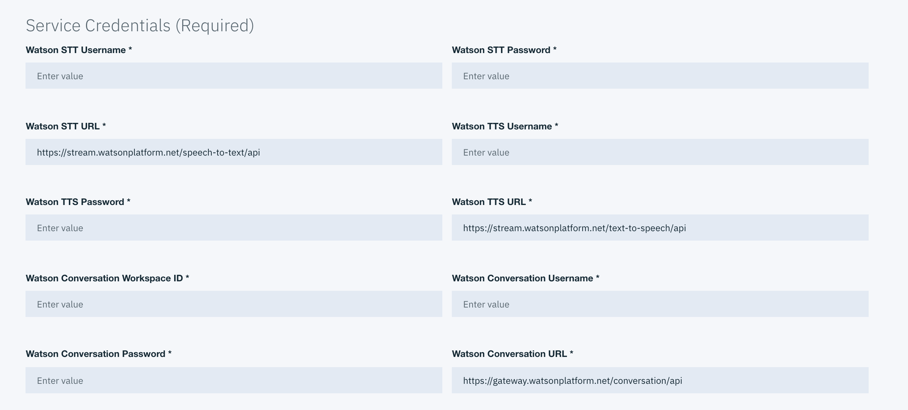
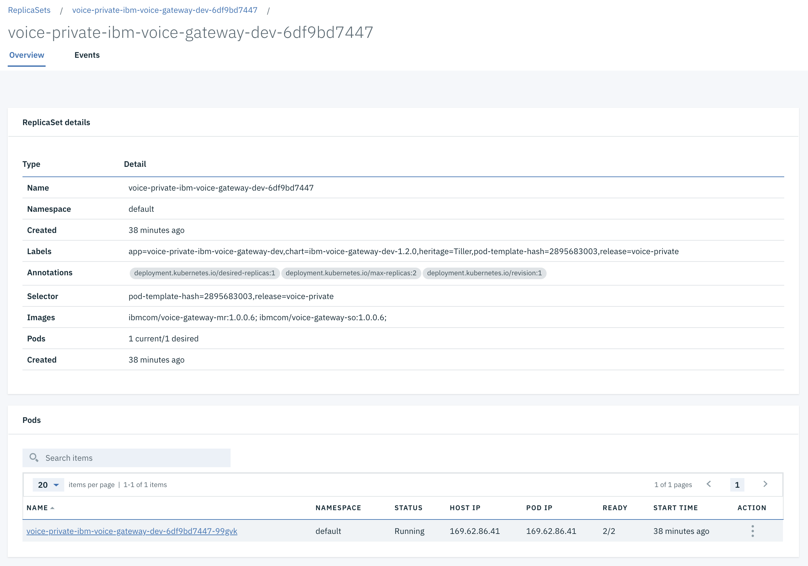
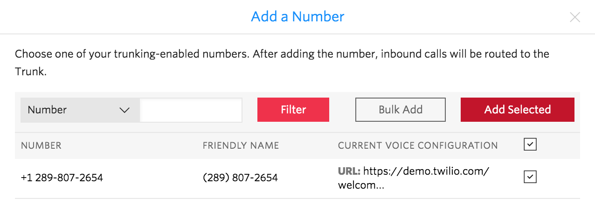

# Automating Call Centers with Voice Gateway on IBM Cloud Private

This code pattern is a Voice Gateway application that enables companies to automate their call centers using Watson Assistant, Text to Speech, and Speech to Text, without having to orchestrate between all the different services yourself; the Voice Gateway will do that for you.

When the reader has completed this Code Pattern, they will understand how to:

* Provision Watson Assistant, Speech to Text, and Text to Speech services on IBM Cloud
* Import a sample Call Center dialog to Watson Assistant
* Deploy a Voice Gateway service on IBM Cloud Private
* Connect Voice Gateway to Twilio via the SIP communication protocol


## Flow

1. User phones a call center phone number, associated with a Twilio account.
2. The Twilio number connects to a configured Voice Gateway service via the SIP communication protocol. Voice Gateway is running on IBM Cloud Private.
3. Voice Gateway calls Watson Speech to Text to transcribe user input.
4. Based on user input, certain flows in Watson Assistant will be triggered.
5. Any results from Watson Assistant will be transmitted back to the Voice Gateway service via Watson Text to Speech.
6. Voice Gateway will sends the audio back via the Elastic SIP Trunk.
7. The resulting audio is played back to the user.

## Included components

* [IBM Cloud Private](https://www.ibm.com/cloud/private): An on-prem version of IBM Cloud to store your sensitive data and applications.
* [IBM Voice Gateway](https://www.ibm.com/support/knowledgecenter/en/SS4U29/welcome_voicegateway.html): A service that enables you to build apps that leverage Assistant, Text to Speech, and Speech to Text, without having to tie them all in manually.
* [Watson Assistant](https://www.ibm.com/watson/developercloud/conversation.html): Create a chatbot with a program that conducts a conversation via auditory or textual methods.
* [Watson Text to Speech](https://www.ibm.com/watson/developercloud/text-to-speech.html): Converts written text into natural sounding audio in a variety of languages and voices.
* [Watson Speech to Text](https://www.ibm.com/watson/developercloud/speech-to-text.html): A service that converts human voice into written text.
* [Twilio](https://console.ng.bluemix.net/catalog/services/twilio): Integrate voice, messaging, and VoIP into your web and mobile apps.

## Featured Technologies

* [Artificial Intelligence](https://medium.com/ibm-data-science-experience): Artificial intelligence can be applied to disparate solution spaces to deliver disruptive technologies.
* [Python](https://www.python.org/): Python is a programming language that lets you work more quickly and integrate your systems more effectively.

<!--
# Watch the Video

[](https://youtu.be/b-94B3O1czU)
-->

## Prerequisites

* **Twilio account**: [Sign up for free](https://www.twilio.com/try-twilio)
* **IBM Cloud Private Community Edition**: [Deploy instructions](https://github.com/IBM/deploy-ibm-cloud-private)

## Steps

1. [Create Watson services on IBM Cloud](#1-create-watson-services-on-ibm-cloud)
2. [Import the conversation into Watson Assistant](#2-import-the-conversation-into-watson-assistant)
3. [Deploy the Voice Gateway on IBM Cloud Private](#3-deploy-the-voice-gateway-on-ibm-cloud-private)
4. [Configure Voice Gateway and Twilio](#4-configure-voice-gateway-and-twilio)

### 1. Create Watson services on IBM Cloud

Start by heading over to your IBM Cloud catalog and creating the three services listed below:

* [Watson Assistant](https://console.ng.bluemix.net/catalog/services/conversation/)
* [Watson Speech to Text](https://console.bluemix.net/catalog/services/speech-to-text/)
* [Watson Text to Speech](https://console.bluemix.net/catalog/services/text-to-speech/)

We'll need the credentials for each of these. To retrieve them, navigate to each created service and select the **Credentials** tab.

<!--TODO Add a screenshot of credentials here -->

### 2. Import the conversation into Watson Assistant

Now, setup your chatbot - you can either create your own chatbot, use the sample workspace provided in this code pattern, located in [data/workspace.json](data/workspace.json). Use the Watson Assistant tooling to import the dialog to a new workspace. To do this, launch the Watson Assistant tool and use the `import` icon button on the right. Find the [`data/workspace.json`](data/workspace.json) file from the cloned repo and import that to the Watson Assistant tool.

Each workspace in Watson Assistant has a specific ID. To find the `Workspace ID` for a given workspace, click the context menu of the workspace and select `View details`. The workspace ID can be copied and saved as we'll need it in the next step.

<!--TODO Add a screenshot of importing the workspace -->

### 3. Deploy the Voice Gateway on IBM Cloud Private

The interface of IBM Cloud Private is, of course, very similar to that of IBM Cloud (public); so you should find it easy to navigate this interface if you're familiar with IBM Cloud.

Head over to the Catalog, and either search for, or scroll down to, the `ibm-voice-gateway-dev` tile and select it.


Once the next screen loads choose to _Configure_ your Voice Gateway service.


You can then enter a _Release name_ (the name of your service), a _Target namespace_ (where to store this service), and then read the license agreements. If you agree, check the checkbox.


Finally, you can ignore all of the fields in the following form except for the Watson API Credential fields - go ahead and fill them all out (Assistant, Speech to Text, Text to Speech). Once you fill out these fields, you can click on the _Install_ button.



Once up and running, you should be able to view the running Voice Gateway service. **NOTE:** Be sure to note the host IP address, we'll be needing that in the next section.



### 4. Configure Voice Gateway and Twilio

For this next section we'll create a new Twilio account. The Twilio account will provide us with a free phone number for a few days and the ability to configure an SIP trunk to connect with our Voice Gateway. Here's the free phone number that we'll use to configure with an SIP trunk.


To create a new SIP trunk connection go to the context menu and select _Elastic SIP Trunking_. Create a new one with a unique name.


We now need to let Twilio know about our Voice Gateway service. Set the _Origination URI_ for our new SIP Trunk. The value should look like the line below.

```
sip:icp_ip_address:voice_gateway_port;transport=tcp
```

Where `icp_ip_address` is the ICP IP address and `voice_gateway_port` the Voice Gateway port. By default the port is `5060`.


The last step is to associate our free number with the SIP Trunk. Click on the _Numbers_ sub menu and add the phone number from the beginning of this step.



You're now ready to test things out!

## Sample output

Once the Twilio configuration has been completed try calling the phone number. You'll be greeted with the start of your Watson Assistant dialog. Try a few of the questions below to hear back the answers.

* _What are the hours of operation?_
* _What's your location?_
* _Can I speak to an advisor?_
* _I'd like to make an appointment_

## Links

* [Deploy IBM Cloud Private](https://github.com/IBM/deploy-ibm-cloud-private/): Instructions and scripts to automate the deployment of IBM Cloud Private on several platforms.
* [Getting started with Voice Gateway](https://www.ibm.com/support/knowledgecenter/en/SS4U29/gettingstarted.html): Instructions on how to get started with Voice Gateway on Docker, Kubernetes, and IBM Cloud Private.
* [Setting up a Twilio SIP trunks](https://www.ibm.com/support/knowledgecenter/SS4U29/twilio.html): Setting up a Twilio SIP trunk for self-service agents with IBM Voice Gateway.

## Learn more

* **Artificial Intelligence Code Patterns**: Enjoyed this Code Pattern? Check out our other [AI Code Patterns](https://developer.ibm.com/code/technologies/artificial-intelligence/).
* **AI and Data Code Pattern Playlist**: Bookmark our [playlist](https://www.youtube.com/playlist?list=PLzUbsvIyrNfknNewObx5N7uGZ5FKH0Fde) with all of our Code Pattern videos
* **With Watson**: Want to take your Watson app to the next level? Looking to utilize Watson Brand assets? [Join the With Watson program](https://www.ibm.com/watson/with-watson/) to leverage exclusive brand, marketing, and tech resources to amplify and accelerate your Watson embedded commercial solution.

## License

[Apache 2.0](LICENSE)
